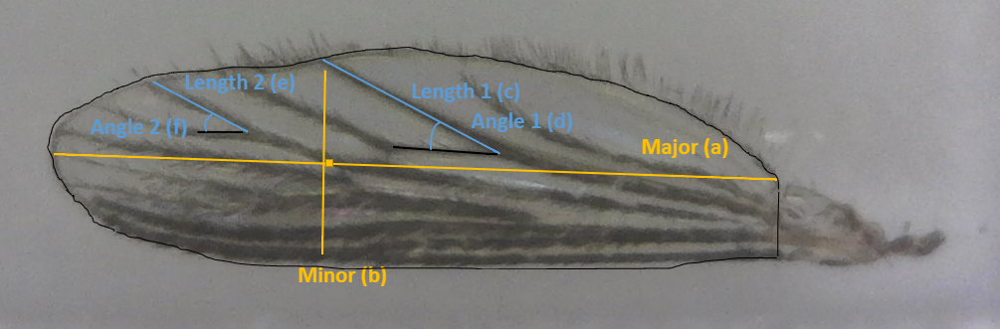
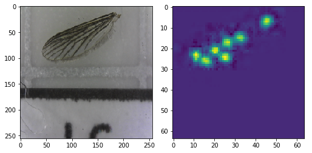
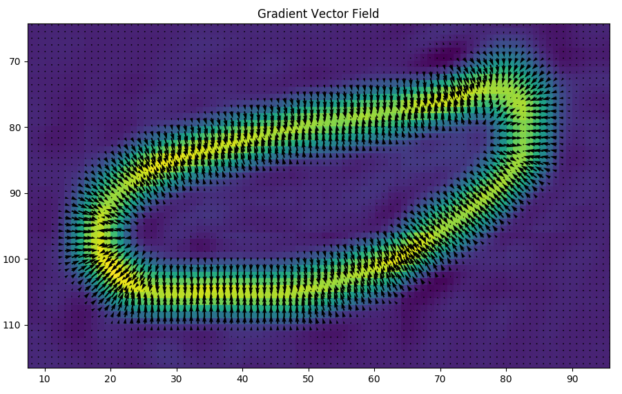
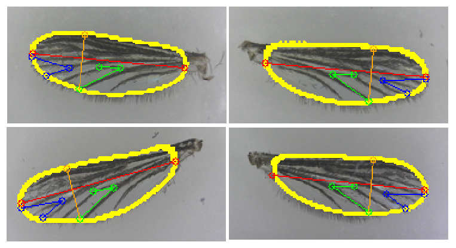
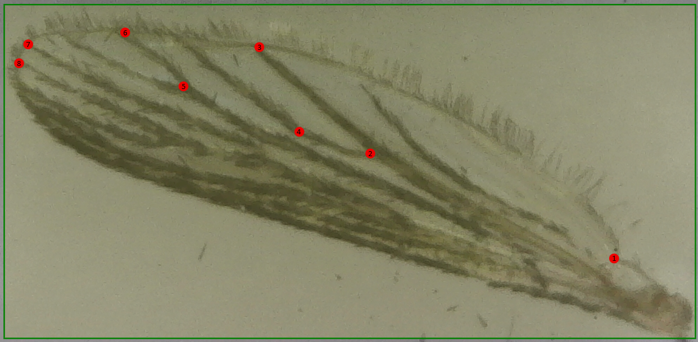
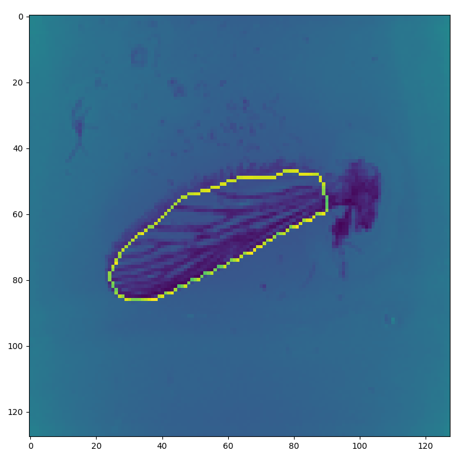

# WingPose
Pose estimation of mosquito wings with deep learning. Using an autoencoder architecture, heatmaps can be generated from the image to give the location of keypoints and contour used in the measurement of wings.

### Desired measurements

### Keypoint Detection
We apply gaussian smoothing to both keypoints and the contour for heatmap training.

### Contour Detection
To retrieve a sharp contour we calculate the gradient vector field of the output heatmap.

### Final Output

## Dataset
The dataset was created from a lab interested in the development of adult mosquitos. Currently 8 x,y coordinate values and contour coordinates are used for the dataset. Each point and contour is assigned its own channel in the heatmap output, totaling to 9 channels.

#### Order of keypoints

#### Contour annotation

## Steps
1. Label with [imglab.ml](imglab.ml)
2. Convert xml file to csv with xml2csv.py 
  &nbsp;&nbsp;- json files will be used for contour polygons 
3. Use heatmap.py to generate GT labels for keypoints
4. imgdata.py to store all images as a numpy array
5. Train with autoencoder.py and save weights
6. Run hm2pose.py to interpret heatmaps to keypoints and display poses
