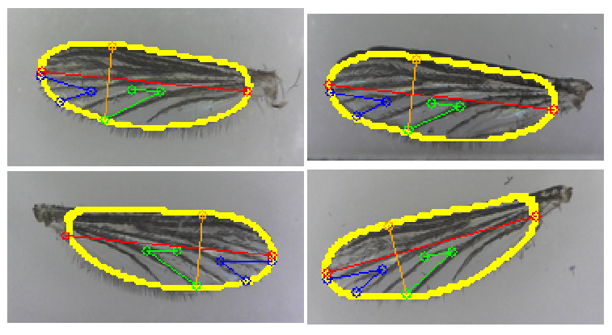

# WingPose
Pose estimation of mosquito wings with deep learning. Using an autoencoder architecture, heatmaps can be generated from the image to give the location of keypoints used in the measurement of wings.

### Keypoint Detection

### Contour Detection
We calculate the gradient vector field of the output heatmap to retrieve a sharp contour.

### Model Output

## Dataset
The dataset was created from a lab interested in the development of adult mosquitos. Currently 8 x,y coordinate values are used for the dataset. In the future the perimeter or area of the wing will be included as a contour or object pixel classification. A link to the set of images will be included shortly.

### Order of keypoints

## Steps
1. Label with [imglab.ml](imglab.ml)
2. Convert xml file to csv with xml2csv.py 
  &nbsp;&nbsp;- json files will be used for contour polygons 
3. Use heatmap.py to generate GT labels for keypoints
4. imgdata.py to store all images as a numpy array
5. Train with autoencoder.py and save weights
6. Run hm2pose.py to interpret heatmaps to keypoints and display poses
