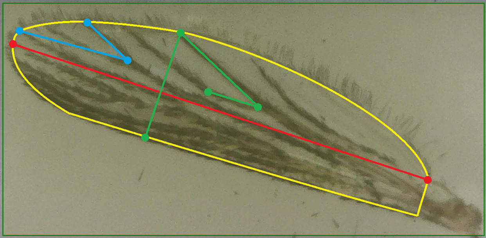

# WingPose
Pose estimation of mosquito wings using deep learning. Using an autoencoder architecture, heatmaps can be generated from the image to give the location of keypoints used in the measurement of the wing.

### Prototype

### Current examples

### Final Goal

## Dataset
The dataset was created from a lab interested in the development of adult mosquitos. Currently 8 x,y coordinate values are used for the in the dataset. In the future the perimiter or area of the wing will be included. A link to the set of images will be included shortly.

### Order of keypoints

Points 
1: 
2: 
3: 
4: 
5: 
6: 
7: 
8: 
